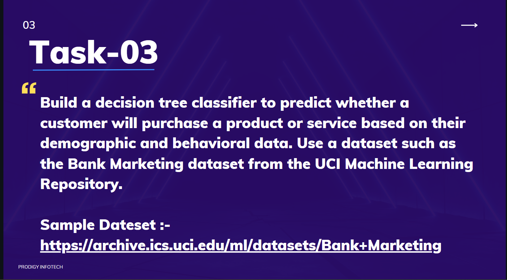

📊 Bank Marketing Prediction - Task 3 (Internship at Prodigy Infotech) 💼
=========================================================================

This repository contains a machine learning project designed to predict whether a client will subscribe to a term deposit, based on various customer attributes. This is part of \*\*Task 3\*\* of my internship at \*\*Prodigy Infotech\*\*. The project involves data preprocessing, feature engineering, model training, and the development of an interactive web application for real-time predictions. 🚀

🔍 Project Overview
-------------------

The goal of this project is to build a predictive model using a \*\*Decision Tree Classifier\*\* 🌳 to predict whether a client will subscribe to a term deposit based on their features such as age, job type, marital status, balance, and past campaign history. In addition, a web-based application has been developed to allow users to input their own features and get predictions in real-time. 💻

🎯 Project Objectives
---------------------

*   🔧 Preprocess and clean the dataset, handle missing values, and encode categorical features.
*   🧠 Train a \*\*Decision Tree Classifier\*\* to predict term deposit subscriptions.
*   📊 Evaluate the model’s performance using various metrics such as accuracy and precision.
*   🌐 Develop a user-friendly web application to make real-time predictions based on user input.
*   🚀 Deploy the web application on a cloud platform for easy access.

📈 Expected Outcomes
--------------------

*   ✅ A trained \*\*Decision Tree Classifier\*\* model that can predict whether a client will subscribe to a term deposit.
*   🔍 Detailed analysis and feature importance insights showing which client attributes are most influential in predicting subscription.
*   💻 An interactive \*\*web application\*\* where users can enter personal details and receive real-time predictions on whether they will subscribe to a term deposit.
*   🌍 Deployment of the application on a cloud platform for easy public access.

🛠️ Methodology
---------------

*   **Data Collection and Preprocessing:** 📂 Load the dataset, clean it, handle missing values, and encode categorical features.
*   **Feature Selection and Engineering:** 🎯 Select important features that impact the target variable (subscription to term deposit).
*   **Model Training:** 🧑‍💻 Train a \*\*Decision Tree Classifier\*\* to predict term deposit subscriptions based on selected features.
*   **Model Evaluation:** 📉 Evaluate the trained model using accuracy, precision, recall, and F1-score.
*   **Web Application Development:** 🖥️ Build a simple web application using \*\*Streamlit\*\* or \*\*Flask\*\* to allow users to input their features and receive predictions.
*   **Deployment:** 🌐 Deploy the application on \*\*Heroku\*\* or \*\*Streamlit Sharing\*\* for easy access by users.

🧰 Technologies Used
--------------------

*   🐍 **Python** - For data processing, model training, and web application development.
*   📚 **Scikit-learn** - For training the \*\*Decision Tree Classifier\*\* model.
*   📦 **Streamlit/Flask** - For developing the interactive web application for real-time predictions.
*   ☁️ **Streamlit Sharing** - For cloud deployment of the web application.

    

👨‍💻 Contributors
------------------

This project was developed as part of my internship at \*\*Prodigy Infotech\*\*. I am the sole contributor to this repository. 💪

📜 License
----------

This project is licensed under the MIT License - see the [LICENSE](LICENSE) file for details. 📄

📩 Contact
----------

If you have any questions, feel free to reach out to me at akashanandani.56@gmail.com. 📧
